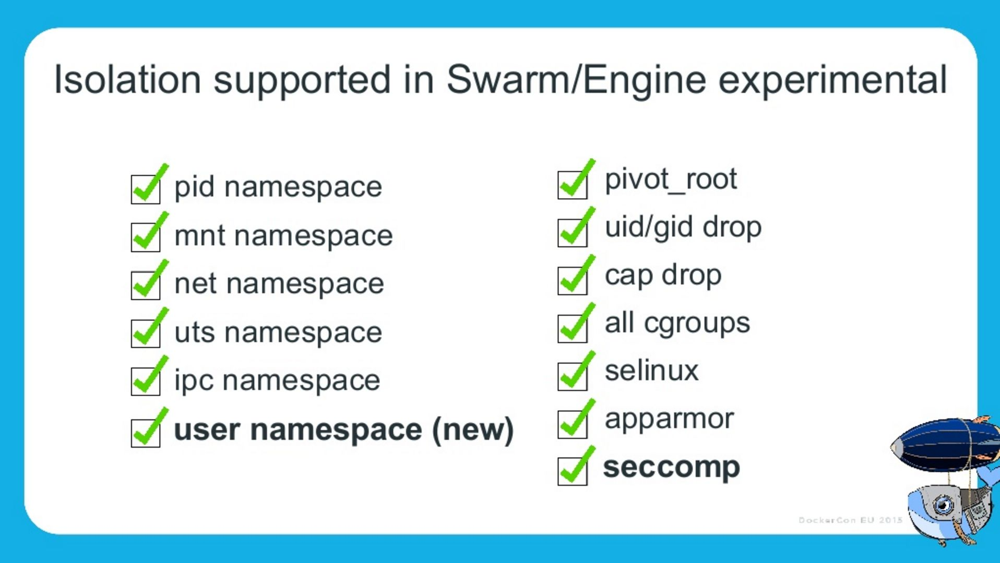

= Docker en Production ? Et la Sécurité ... ?
Jean-Marc Meessen
:backend: revealjs
:revealjs_theme: league
:revealjs_control: false
:revealjs_slideNumber: true

== Bonjour ==

[%step]
* Jean-Marc MEESSEN
* Bruxelles, Belgique
* "Brol Engineer" @ Worldline-BE
* (Development Infrastructure Expert)

== !
// source: http://www.youtube.com/watch?v=ImKox57DJXI
// source: http://www.coolfood.be/test/media/catalog/product/cache/1/small_image/9df78eab33525d08d6e5fb8d27136e95/i/g/igl50150506_-_10_fish_sticks_300g_hr_selenium_13.jpg
video::images/CaptainIglo.mp4[video, width=800, poster="images/fishSticks.jpg"]

== Et vous ? ==

[%step]
* développeurs ?
* Ops ?
* Sécurité ?
* Manager ?

[NOTE.speaker]
--
Actually things aren't that bad
--

== Vous et Docker ? ==

[%step]
* Jamais entendu parlé ?
* Quelques "Proof of Concept" ?
* L'utilise tout les jours ?
* En Production ?

// source: http://www.echecparadisfiscaux.ca/wp-content/uploads/2013/04/les-problemes.jpg
[data-background="images/problemes.jpg"]
== !

== Docker en production ?

Voilà en général la réaction...

== !

// Source: https://bobstechsite.com/wp-content/uploads/2013/12/d8a448abb3779dd23ea09d0d8ac2475b2aeb2687.jpg

== Le problème ==

* La popularité de Docker est le reflet du pass:[<u>désir de moins en moins de friction</u>].
* Sa facilité d'utilisation fait qu'on néglige les vérifications et les compromis.

== !

Et pourtant la *Sécurité* est importante.

[NOTE.speaker]
--
Actually things aren't that bad
--

== Et pourquoi ? ==

* Nos clients nous confient leurs systèmes / leurs données.
* Il n'y a pas de sanctions pour les entreprises IT
** seulement un coût
** pas de principe "pollueur/payeur"

== !

J'estime que nous avons une responsabilité morale de rappeler les bonnes pratiques à nos managers.

== La situation de Docker

// source: http://www.it-wars.com/images/cloudcomputing/docker-security.jpg

== Rappel

// source: https://media.licdn.com/mpr/mpr/shrinknp_800_800/AAEAAQAAAAAAAAQzAAAAJDY1YTU3M2NkLTc3OTEtNGQ1My1iMDkyLTFmNDUzMzc5MmZjNQ.jpg
image::images/docker_overview.jpg[]

== Que cherche-t-il ?

// source: http://digitalhealthage.com/wp-content/uploads/2015/10/Dave-hacking-story.jpg
image::images/hacker.jpg[]

== Que cherche-t-il ?

* Des données
* Accéder à d'autres systèmes
* Élévation de privilège

// source: http://www.maxtechstore.com/images/treasure-chest.jpg
image:images/treasure.jpg[treasure,300]

== Les dangers avec Docker ?

[%step]
* Kernel exploits
* Denial of service attack
* Container breakout
* Poisoned images
* Compromising Secrets

[NOTE.speaker]
--
* Amplification.
* un container peut tout bloquer
* sortir
* Poisoned images
* access DB
--

== Est-ce que Docker est "secure" ?

* Beaucoup d'attentes, d'illusions
* "Silver bullet"
* positionnement de concurrents (VM, Configuration Mgt)
* jalousie

== Docker, Inc et la sécurité

* La Sécurité (= opérabilité) est une de leur préoccupation fondamentale
* Conscient de la jeunesse de la technologie
* Très réactifs
* Attitude positive sur l'approche

== !

image::images/docker_slide_1.jpg[]

== !

image::images/docker_slide_2.jpg[]

== !

image::images/docker_slide_3.jpg[]

== "Container do not contain !"

* perception erronée du "public"
* Progrès énormes en 3 ans
** mais utilisable...

[NOTE.speaker]
--
utiliser techno pour ce qu'elle est
préoccupation initiale
(early adopters en prod): env mutualisé/cloud
--

== !

image::images/docker_overview.jpg[]

== !

image::images/docker_slide_4.jpg[]

[NOTE.speaker]
--
* PID renumérotation des process
--

== !

image::images/docker_slide_5.jpg[]

== !

== En particulier

* Cap drop
* User namespace
* selinux / apparmor

== Capability Drop

* option du "Docker run"
* vas au de la de la dichotomie root/non-root
* exemple container avec NTP

----
docker run --cap-drop ALL --cap-add SYS_TIME ntpd
----

== User namespace

// source: http://forex-ecole.com/wp-content/uploads/2015/07/requst-a-demo.jpg
image::images/demo.jpg[demo, 500]

== Selinux / apparmor

* profils appelés à chaque "Docker run"
* permettent d'aller plus loin dans la granularité
** tel programme (ex ping) n'a pas accès au réseau

== !

----
#include <tunables/global>

profile docker-default flags=(attach_disconnected,mediate_deleted) {

  #include <abstractions/base>

  network,
  capability,
  file,
  umount,

  deny @{PROC}/{*,**^[0-9*],sys/kernel/shm*} wkx,
  deny @{PROC}/sysrq-trigger rwklx,

  deny mount,

  deny /sys/[^f]*/** wklx,
  deny /sys/f[^s]*/** wklx,
  deny /sys/fs/[^c]*/** wklx,
  deny /sys/fs/c[^g]*/** wklx,
}
----

// source : http://techbeacon.com/sites/default/files/styles/article_main_image/public/9_0.jpg?itok=j6kSlRwH
[data-background="images/container_wall.jpg"]
== Des containers "propre" ?

== !

* Contenus malveillants
* Contenus buggés ou vulnérables

== Trusted Registry

* Utilisation systématique de TLS
* renforcement de l'identification des layers
* upgrade avec la version 1.10

== Notary

* Système de signature d'images et de validation
** vérification de l'auteur et non-altération du contenu
* Protection Against Image Forgery
* Protection Against Replay Attacks
* Protection Against Key Compromise
** Utilisation de support physique pour les clés

== Yubikey 4

//source yubico
image::images/yubikey1.png[]

image::images/yubikey2.png[]

== Nautilus

* Scanner d'images Docker
** Vulnérabilité (CVE check)
** Validation des licences
** Optimisation des images
** Tests fonctionnels simplifiés

== Recommendations

// source: http://hygiene-plus.com/wp-content/uploads/2014/08/IPRP_prevention_risque_salon_coiffure_institut_beaute_2.jpg
image::images/prevention.jpg[prevention,550]

== Recommandations

[%step]
* Maintenir votre host/images à jour
* Cloisonner
** partition disque Docker séparée
** pas exploiter d'autres applis
** Container dans une VM ?
* Limiter les communications inter-container
* logger/auditer
* contrôle d'accès

== Recommendations

[%step]
* Ne pas utiliser "priviliged" si c'est pas nécessaire
* Users applicatifs dans les containers
* d'où viennent mes images ? Sont elles à jour ?
* permissions sur les fichiers

== Conclusions

* "Docker est-il 'secure' ?"
** Pas plus ni moins que la porte d'un appartement
* La sécurité est l'affaire de tous : DevOps + SecOps

== Contact info

image::images/capt_igloo_cleaned.jpg[captain, 200]

* jean-marc@meessen-web.org
* Twitter: @jm_meessen

// source: http://www.dokeos.com/wp-content/uploads/2014/06/29-questions-test-Dokeos-EN.jpg
[data-background="images/questions.jpg"]
== !

== Crédits photographiques

* http://www.youtube.com/watch?v=ImKox57DJXI[Vidéo Capt. Igloo]
* http://www.coolfood.be/test/media/catalog/product/cache/1/small_image/9df78eab33525d08d6e5fb8d27136e95/i/g/igl50150506_-_10_fish_sticks_300g_hr_selenium_13.jpg[Boite de fishSticks]
* http://www.echecparadisfiscaux.ca/wp-content/uploads/2013/04/les-problemes.jpg[Question]
* https://bobstechsite.com/wp-content/uploads/2013/12/d8a448abb3779dd23ea09d0d8ac2475b2aeb2687.jpg[Panique]
* http://www.it-wars.com/images/cloudcomputing/docker-security.jpg[Docker shark]
* https://media.licdn.com/mpr/mpr/shrinknp_800_800/AAEAAQAAAAAAAAQzAAAAJDY1YTU3M2NkLTc3OTEtNGQ1My1iMDkyLTFmNDUzMzc5MmZjNQ.jpg[Docker overview]

== Crédits photographiques - 2

* http://digitalhealthage.com/wp-content/uploads/2015/10/Dave-hacking-story.jpg[Hacker]
* http://www.maxtechstore.com/images/treasure-chest.jpg[Trésor]
* Slides de la Keynote de Dockercon 2015 à Barcelone
* http://forex-ecole.com/wp-content/uploads/2015/07/requst-a-demo.jpg[Démo]
* http://hygiene-plus.com/wp-content/uploads/2014/08/IPRP_prevention_risque_salon_coiffure_institut_beaute_2.jpg[prévention]
* http://www.dokeos.com/wp-content/uploads/2014/06/29-questions-test-Dokeos-EN.jpg[Question]
