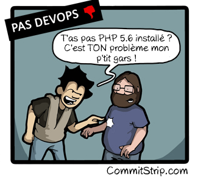
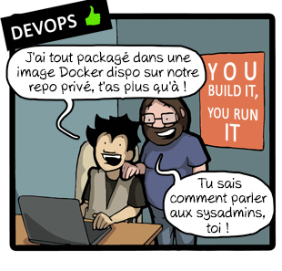
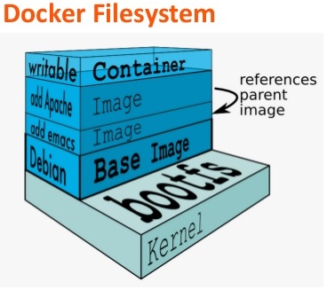
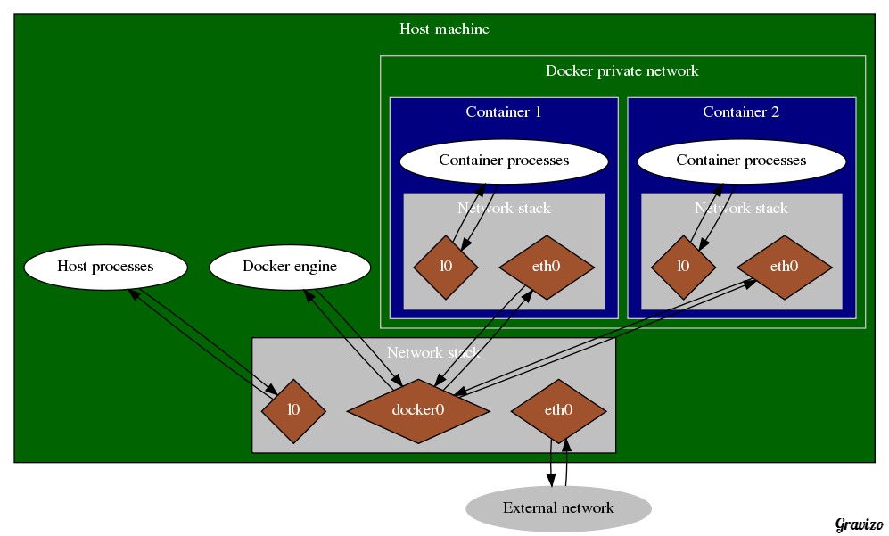
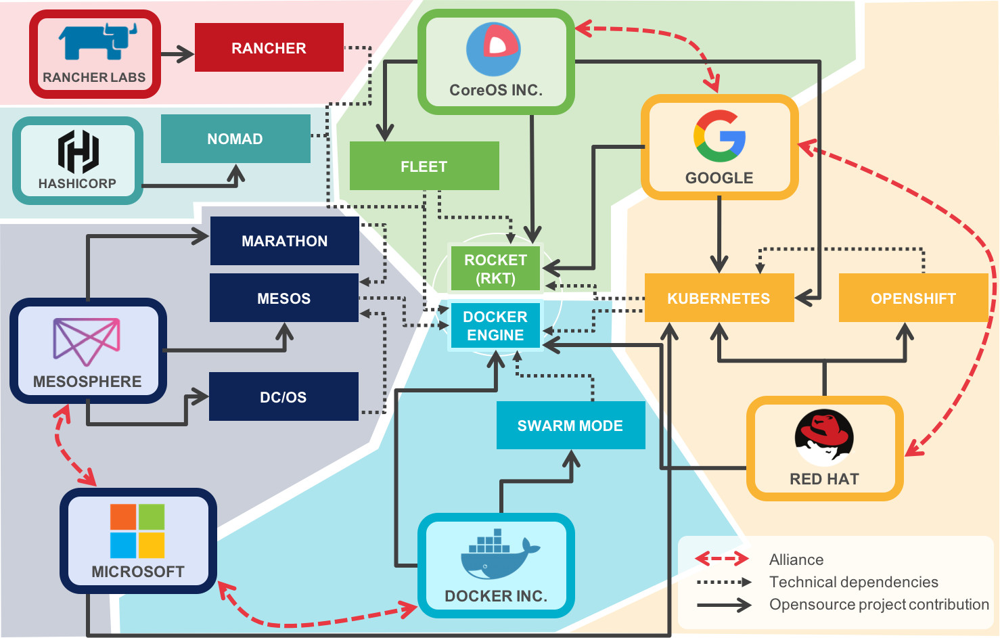

= What is this "Docker" ?
Jean-Marc Meessen
:backend: revealjs
:revealjs_theme: league
:revealjs_control: false
:revealjs_slideNumber: true

== !

image::images/I-have_a_dream.jpg[width=100%]

[NOTE.speaker]
--
I have a dream ....

(I have many dreams)
--

== !

pass:[
I &nbsp;&nbsp; <u>had</u> &nbsp;&nbsp; a dream !
]

== !

* My own copy of the database
** ... that I can break at will
* My own iso-prod test environment
** ... that I can break at will
* Easily share my configuration with colleagues.
* pass:[
DEVOPS !
]

[NOTE.speaker]
--
That I don't fear to break !
DEVOPS is a culture.
--

== !

pass:[
...And it became true !
]

[data-background="images/docker_toolbox.png"]
== !

== !

== !

== Hello ! ==

[%step]
* Jean-Marc MEESSEN
* Brussels, Belgium
* Customer Success Manager @ Cloudbees
** (Since January)
* Before (@ Worldline)
** Senior ESB Java Developer
** Development Infrastructure Expert
** Mentor

== !
// source: http://www.youtube.com/watch?v=ImKox57DJXI
// source: http://www.coolfood.be/test/media/catalog/product/cache/1/small_image/9df78eab33525d08d6e5fb8d27136e95/i/g/igl50150506_-_10_fish_sticks_300g_hr_selenium_13.jpg
video::images/CaptainIglo.mp4[data-autoplay, video, width=800, poster="images/fishSticks.jpg"]

== Contact info

* jean-marc@meessen-web.org
* Twitter: @jm_meessen

{nbsp}

image::images/cc-by-sa.png[cc-by-sa,150]

== And you ? ==

[%step]
* Developers ?
* Ops ?
* Security ?
* Managers ?

[NOTE.speaker]
--
Actually things aren't that bad
--

== You and Docker ? ==

[%step]
* Never heard about it ?
* Some "Proof of Concept" ?
* Use it every day ?
* In Production ?

== Today's talk

* What are "containers" ?
* How to start ?
* The principles (single container)
* Multiple containers (Docker Compose)
* Multi-hosts (Docker Swarm)

[data-background="images/ContainerBackground.jpg"]
== !

pass:[
What are "containers" ?
]

== !

image::images\loadingBarrels.jpg[width=80%]

[NOTE.speaker]
--
Docker Container is an analogy to the revolution in the Shipping industry brought by the container.
--

== !

image::images\also-a-matrix-from-hell.jpg[width=80%]

== !

image::images\theBox.png[width=80%]

== !

image::images\Transport-Multimodal-Service.jpg[width=80%]

== !

image::images\the-matrix-from-hell.jpg[width=80%]

== Docker Containers

[%step]
* is not a virtualization technique,
* rather an *isolation* technology.

== !

image::images\vm-and-container.png[width=100%]

== !

image::images\container_vs_vm.jpg[width=110%]

== Docker Containers are :

[%step]
* NameSpaces
** isolates and virtualizes system resources
*** (process, mounts, networking)
* cgroups (control groups)
** limits CPU, memory, IOs, etc

== !

image::images\why-docker-lightweight.jpg[width=110%]

== Applications packaged with system dependencies

* new packaging paradigm
* one application works on Ubuntu with Python 2
* second application works on Centos 7.2 with Python 3

== What Docker solves

[%step]
* Escape the dependencies hell
* Fast iterative Infrastructure improvement
* Container "loader" & Container "shipper"
** (no more "it worked in Dev, now it's OPS problem")
* easy onboarding of Devs.
* "Own test environment"

[data-background="images/ContainerBackground.jpg"]
== !

pass:[
How to start ?
]

== sandbox

*  http://play-with-docker.com/
** Validate captcha
** 4 hours to play with "Docker instances"
** Just click "Add a new instance"
** Machine starts and you have access to the command line

== Need a container-enabled "Kernel"

* 64-bit Linux installation
* version 3.10 or higher of the Linux kernel
* recommend using the Docker repositories
** See the Docker online documentation https://www.docker.com/products/overview

== And on Windows or Mac OS X ?

[%step]
* Installed in a virtual machine (ex VirtualBox)
** Running Linux
* Ready made bundles:
** Docker Toolbox (Mac / Windows)
** Docker for Mac (native, uses `xhyve`)
* Using (corporate) proxies: advanced topic

== Docker for Windows

* "on" != "for"
* Runs native Windows applications 
* with Hyper-V
* 64bit Windows 10 Pro, Enterprise and Education

[data-background="images/ContainerBackground.jpg"]
== !

pass:[
How does it work ?
]

== Some theory....

== !

== !

image::images\basics-of-docker-system.jpg[width=100%]

== !

image::images\changes-and-updates.jpg[width=110%]

== Let me show you ....

== How do you get images ?

[%step]
* Note: an image is immutable
* you get them from
** DockerHub
** Corporate Registry
* Or build it yourself

== Building a Docker Image

* Described in a Dockerfile

== !

[source, language="Dockerfile"]
----
FROM ubuntu
MAINTAINER Kimbro Staken

RUN apt-get install -y software-properties-common python
RUN add-apt-repository ppa:chris-lea/node.js
RUN echo "deb http://us.archive.ubuntu.com/ubuntu/ precise universe" >> /etc/apt/sources.list
RUN apt-get update
RUN apt-get install -y nodejs
#RUN apt-get install -y nodejs=0.6.12~dfsg1-1ubuntu1
RUN mkdir /var/www

ADD app.js /var/www/app.js

CMD ["/usr/bin/node", "/var/www/app.js"]
----

== networking

== !

== storage

* Stateless, statefull, persistence
* Storage drivers
* map a local directory as a volume
* create and share a data volume

[data-background="images/ContainerBackground.jpg"]
== !

pass:[
Multi-container infra
]

== Describe a complete Infrastructure

* Complex systems
** Fuse ESB server
** MQ series servers
** Oracle database
* Use "docker-compose"

== docker-compose

* one place to define
** your components
** how to (docker) build them
** what container should start first
** networks (who can talk to whom)
** (data) volumes
** Security restrictions
** Etc.

== docker-compose

* three step process
** dockerfile of individual images
** Define services
*** Run parameters
*** Network Relationships
*** dependencies
** `docker-compose up`

== docker-compose

* Commands to manage the whole application lifecycle
** Start, stop and rebuild services
** View the status of running services
** Stream the log output of running services
** Run a one-off command on a service

== Demo

image::images\composeDemo.png[width=100%]

== Try it

* connect to wifi `PI-LAB` with password `raspberry`
* in browser, connect to `http://rpi3-1.local:5000` to vote.
* connect to `http://rpi3-1.local:5001` to view results

[data-background="images/ContainerBackground.jpg"]
== !

pass:[
Multi-node infra
]

== !

image::images\docker-swarm-1.jpg[width=100%]

== !

image::images\swarm-arch.jpg[width=100%]

== How to learn ?

* Many tutorials available on-line
* https://training.docker.com/category/self-paced-online
** Developer
*** Beginner Linux Containers
*** Beginner Windows Containers
*** Intermediate (both Linux and Windows)
** Operations
*** Beginner
*** Intermediate

== How to learn ?

* Docker playground
** http://play-with-docker.com/

[data-background="images/ContainerBackground.jpg"]
== !

pass:[
Where is Docker heading ?
]

== Docker Inc.

[%step]
* Docker has been surprised by this techno "flare"
* Very, very lively Open Source community
* "Batteries included"
* Standardization (RunC, etc.)

== Well grounded approach

* Coming from the web hosting world

image::images/docker_unusable_scy.jpg[width=80%]

== Status

* Was good for development and integration
* Start to be usable for Real Life Run
** Since December 2015

== Status

* Start to offer enterprise level solutions
** "Docker Datacenter"
*** Trusted Registry (Image scanning, sig/auth)
*** Docker Universal Control Plane
** Docker Cloud

== Containerus Bellum

http://blog.octo.com/containerus-bellum-ou-la-chronique-des-hostilites-dans-lecosysteme-docker/

[data-background="images/ContainerBackground.jpg"]
== !

pass:[
Docker in Production
]

== Docker in Production

* you need to have a very good understanding of what you do
* still in the early phase
* Docker works very well for **state less** application
* State full (with databases, etc) still in infancy. Recent announcement very promising

[data-background="images/ContainerBackground.jpg"]
== !

pass:[
Is Docker secure enough for Production ?
]

== !

This is, in general, the reaction...

== !

// Source: https://bobstechsite.com/wp-content/uploads/2013/12/d8a448abb3779dd23ea09d0d8ac2475b2aeb2687.jpg
image::images/panique.jpg[afraid,70%]

== the situation with Docker

// source: http://www.it-wars.com/images/cloudcomputing/docker-security.jpg

== What is he looking for?

// source: http://digitalhealthage.com/wp-content/uploads/2015/10/Dave-hacking-story.jpg

== What is he looking for?

* (user) Data
* Access other systems
* Privilege elevation

// source: http://www.maxtechstore.com/images/treasure-chest.jpg
image:images/treasure.jpg[treasure,300]

== What are the dangers with Docker?

[%step]
* Kernel exploits
* Denial of service attack
* Container breakout
* Poisoned images
* Compromising Secrets

[NOTE.speaker]
--
* Amplification.
* un container peut tout bloquer
* sortir
* Poisoned images
* access DB
--

== Is Docker "secure" ?

* A lot of expectations, of illusions
* "Silver bullet"
* Competition positioning (VM, Configuration Mgt)
* Enviousness

== "Container do not contain !"

* Wrong perception by the "public"
* Tremendous progress in 3 years
** but usable...

[NOTE.speaker]
--
utiliser techno pour ce qu'elle est
préoccupation initiale
(early adopters en prod): env mutualisé/cloud
--

== Equipped with security tools

== In particular

* Cap drop
* User namespace
* selinux / apparmor

== Capability Drop

* options to the "Docker run"
* goes beyond the root/non-root dichotomy
* example: container with NTP

----
docker run --cap-drop ALL --cap-add SYS_TIME ntpd
----

== Selinux / apparmor

* profiles are called at each "Docker run"
* Allow to go much further in the granularity
** this program (ex ping) has no access to the network

== !

----
#include <tunables/global>

profile docker-default flags=(attach_disconnected,mediate_deleted) {

  #include <abstractions/base>

  network,
  capability,
  file,
  umount,

  deny @{PROC}/{*,**^[0-9*],sys/kernel/shm*} wkx,
  deny @{PROC}/sysrq-trigger rwklx,

  deny mount,

  deny /sys/[^f]*/** wklx,
  deny /sys/f[^s]*/** wklx,
  deny /sys/fs/[^c]*/** wklx,
  deny /sys/fs/c[^g]*/** wklx,
}
----

// source : http://techbeacon.com/sites/default/files/styles/article_main_image/public/9_0.jpg?itok=j6kSlRwH
[data-background="images/container_wall.jpg"]
== "Clean" containers?

== !

* Malicious contents
* Contains vulnerabilities or bugged applications

== Trusted Registry

* Systematic use of TLS
* Re-enforcement of the layers integrity
* Upgraded with version 1.10

== Notary

* System of image signature and its validation
** Validation of the author and content non alteration
* Protection Against Image Forgery
* Protection Against Replay Attacks
* Protection Against Key Compromise
** Clever usage of physical key storage

== Nautilus

* (now called "Docker Security Scanning")
* Docker image scanner
** vulnerabilities (CVE check)
** Licence validation
** Image Optimisation
** Simplified functional tests

== Recommendations

// source: http://hygiene-plus.com/wp-content/uploads/2014/08/IPRP_prevention_risque_salon_coiffure_institut_beaute_2.jpg
image::images/prevention.jpg[prevention,550]

== Recommendations

[%step]
* Keep your host/images up-to-date
* "Bulkheading"
** Seperate disk partition for Docker
** Don't run other (non-Docker) applications on the same host
** Container in a VM ?
* Limit inter-container communications
* log/audit trails
* Access control

== Recommendations

[%step]
* Do not use "priviliged" if it is not necessary
* Applicative users in the containers
* Where are my images coming from ? are they up-to-date ?
* Access rights on the files

== Conclusions

* "Is Docker 'secure' ?"
** No more or less then the door of an apartment
* Security is everyone's business : DevOps + SecOps

== Thank You !

== Contact info

* jean-marc@meessen-web.org
* Twitter: @jm_meessen

// source: http://www.dokeos.com/wp-content/uploads/2014/06/29-questions-test-Dokeos-EN.jpg
[data-background="images/questions.jpg"]
== !
