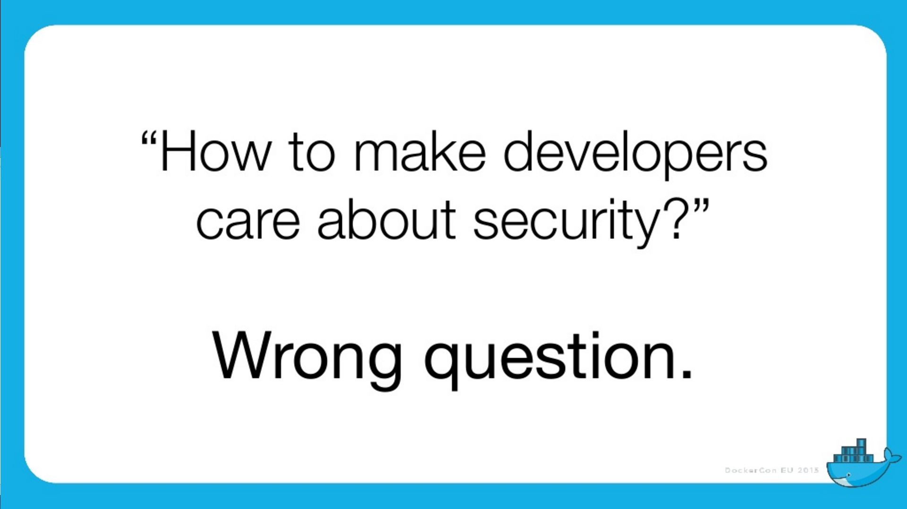

= Docker in Production ? And what about Security ... ?
Jean-Marc Meessen
:backend: revealjs
:revealjs_theme: league
:revealjs_control: false
:revealjs_slideNumber: true

== Hello ! ==

[%step]
* Jean-Marc MEESSEN
* Bruxelles, Belgique
* EWC-FPL-Be Middleware developer
* (Development Infrastructure Expert)

== !
// source: http://www.youtube.com/watch?v=ImKox57DJXI
// source: http://www.coolfood.be/test/media/catalog/product/cache/1/small_image/9df78eab33525d08d6e5fb8d27136e95/i/g/igl50150506_-_10_fish_sticks_300g_hr_selenium_13.jpg
video::images/CaptainIglo.mp4[video, width=800, poster="images/fishSticks.jpg"]

== And you ? ==

[%step]
* Developers ?
* Ops ?
* Security ?
* Managers ?

[NOTE.speaker]
--
Actually things aren't that bad
--

== You and Docker ? ==

[%step]
* Never heard about it ?
* Some "Proof of Concept" ?
* Use it every day ?
* In Production ?

// source: http://www.echecparadisfiscaux.ca/wp-content/uploads/2013/04/les-problemes.jpg
[data-background="images/problemes.jpg"]
== !

== Docker in production ?

This is, in general, the reaction...

== !

// Source: https://bobstechsite.com/wp-content/uploads/2013/12/d8a448abb3779dd23ea09d0d8ac2475b2aeb2687.jpg
image::images/panique.jpg[afraid,70%]

== The problem ==

* Docker's popularity reflects the pass:[<u>quest for less and less friction</u>].
* Its ease of use leads to compromises and to neglect verification.

== !

And yet *Security* is important.

[NOTE.speaker]
--
Actually things aren't that bad
--

== And why ? ==

* Our customers entrust us their systems / their data.
* No sanctions for failing Companies
** security is only seen as a cost
** no "polluter pays" principle

== !

I believe that we have a moral responsibility to remind our managers of the good (security) practices.

== the situation with Docker

// source: http://www.it-wars.com/images/cloudcomputing/docker-security.jpg
image::images/docker_shark.jpg[docker_shark,80%]

== Reminder

// source: https://media.licdn.com/mpr/mpr/shrinknp_800_800/AAEAAQAAAAAAAAQzAAAAJDY1YTU3M2NkLTc3OTEtNGQ1My1iMDkyLTFmNDUzMzc5MmZjNQ.jpg
image::images/docker_overview.jpg[]

== What is he looking for?

// source: http://digitalhealthage.com/wp-content/uploads/2015/10/Dave-hacking-story.jpg
image::images/hacker.jpg[]

== What is he looking for?

* (user) Data
* Access other systems
* Privilege elevation

// source: http://www.maxtechstore.com/images/treasure-chest.jpg
image:images/treasure.jpg[treasure,300]

== What are the dangers with Docker?

[%step]
* Kernel exploits
* Denial of service attack
* Container breakout
* Poisoned images
* Compromising Secrets

[NOTE.speaker]
--
* Amplification.
* un container peut tout bloquer
* sortir
* Poisoned images
* access DB
--

== Is Docker "secure" ?

* A lot of expectations, of illusions
* "Silver bullet"
* Competition positioning (VM, Configuration Mgt)
* Enviousness

== Docker, Inc and security

* Security (= operability) is one of their fundamental preoccupation
* Aware of the youth of the technology
* Very reactive
* Positive attitude in the approach

== !

== !

image::images/docker_slide_2.jpg[]

== !

image::images/docker_slide_3.jpg[]

== "Container do not contain !"

* Wrong perception by the "public"
* Tremendous progress in 3 years
** but usable...

[NOTE.speaker]
--
utiliser techno pour ce qu'elle est
préoccupation initiale
(early adopters en prod): env mutualisé/cloud
--

== !

image::images/docker_overview.jpg[]

== !

image::images/docker_slide_4.jpg[]

[NOTE.speaker]
--
* PID renumérotation des process
--

== !

image::images/docker_slide_5.jpg[]

== !

image::images/docker_slide_6.jpg[]

== In particular

* Cap drop
* User namespace
* selinux / apparmor

== Capability Drop

* options to the "Docker run"
* goes beyond the root/non-root dichotomy
* example: container with NTP

----
docker run --cap-drop ALL --cap-add SYS_TIME ntpd
----

== User namespace

// source: http://forex-ecole.com/wp-content/uploads/2015/07/requst-a-demo.jpg
image::images/demo.jpg[demo, 500]

== Without User namespace

video::images/userns_demo1.mp4[video, width=100%, poster="images/demo.jpg"]

== With User namespace

video::images/userns_demo2.mp4[video, width=100%, poster="images/demo.jpg"]

== Selinux / apparmor

* profiles are called at each "Docker run"
* Allow to go much further in the granularity
** this program (ex ping) has no access to the network

== !

----
#include <tunables/global>

profile docker-default flags=(attach_disconnected,mediate_deleted) {

  #include <abstractions/base>

  network,
  capability,
  file,
  umount,

  deny @{PROC}/{*,**^[0-9*],sys/kernel/shm*} wkx,
  deny @{PROC}/sysrq-trigger rwklx,

  deny mount,

  deny /sys/[^f]*/** wklx,
  deny /sys/f[^s]*/** wklx,
  deny /sys/fs/[^c]*/** wklx,
  deny /sys/fs/c[^g]*/** wklx,
}
----

// source : http://techbeacon.com/sites/default/files/styles/article_main_image/public/9_0.jpg?itok=j6kSlRwH
[data-background="images/container_wall.jpg"]
== "Clean" containers?

== !

* Malicious contents
* Contains vulnerabilities or bugged applications

== Trusted Registry

* Systematic use of TLS
* Re-enforcement of the layers integrity
* Upgraded with version 1.10

== Notary

* System of image signature and its validation
** Validation of the author and content non alteration
* Protection Against Image Forgery
* Protection Against Replay Attacks
* Protection Against Key Compromise
** Clever usage of physical key storage

== Yubikey 4

//source yubico
image::images/yubikey1.png[]

image::images/yubikey2.png[]

== Nautilus

* (now called "Docker Security Scanning")
* Docker image scanner
** vulnerabilities (CVE check)
** Licence validation
** Image Optimisation
** Simplified functional tests

== Docker Inc's strategy
* Secure Platform
* Secure Content
* Secure Access

== Secure Platform
* Secure Platform
** All available isolation containment
** Default security settings and profiles
** Docker Bench

== Secure Content
* Secure Content
** Docker Content Trust
** Security Scanning

== Secure Access
* Secure Access
** Role Based Access control
** AD/LDAP integration
** Authentication plugins

== Recommendations

// source: http://hygiene-plus.com/wp-content/uploads/2014/08/IPRP_prevention_risque_salon_coiffure_institut_beaute_2.jpg
image::images/prevention.jpg[prevention,550]

== Recommendations

[%step]
* Keep your host/images up-to-date
* "Bulkheading"
** Seperate disk partition for Docker
** Don't run other (non-Docker) applications on the same host
** Container in a VM ?
* Limit inter-container communications
* log/audit trails
* Access control

== Recommendations

[%step]
* Do not use "priviliged" if it is not necessary
* Applicative users in the containers
* Where are my images coming from ? are they up-to-date ?
* Access rights on the files

== Conclusions

* "Is Docker 'secure' ?"
** No more or less then the door of an apartment
* Security is everyone's business : DevOps + SecOps

== Contact info

image::images/capt_igloo_cleaned.jpg[captain, 200]

* jeanmarc.meessen@worldline.com
* Twitter: @jm_meessen

// source: http://www.dokeos.com/wp-content/uploads/2014/06/29-questions-test-Dokeos-EN.jpg
[data-background="images/questions.jpg"]
== !

== Crédits photographiques

* http://www.youtube.com/watch?v=ImKox57DJXI[Vidéo Capt. Igloo]
* http://www.coolfood.be/test/media/catalog/product/cache/1/small_image/9df78eab33525d08d6e5fb8d27136e95/i/g/igl50150506_-_10_fish_sticks_300g_hr_selenium_13.jpg[Boite de fishSticks]
* http://www.echecparadisfiscaux.ca/wp-content/uploads/2013/04/les-problemes.jpg[Question]
* https://bobstechsite.com/wp-content/uploads/2013/12/d8a448abb3779dd23ea09d0d8ac2475b2aeb2687.jpg[Panique]
* http://www.it-wars.com/images/cloudcomputing/docker-security.jpg[Docker shark]
* https://media.licdn.com/mpr/mpr/shrinknp_800_800/AAEAAQAAAAAAAAQzAAAAJDY1YTU3M2NkLTc3OTEtNGQ1My1iMDkyLTFmNDUzMzc5MmZjNQ.jpg[Docker overview]

== Crédits photographiques - 2

* http://digitalhealthage.com/wp-content/uploads/2015/10/Dave-hacking-story.jpg[Hacker]
* http://www.maxtechstore.com/images/treasure-chest.jpg[Trésor]
* Slides de la Keynote de Dockercon 2015 à Barcelone
* http://forex-ecole.com/wp-content/uploads/2015/07/requst-a-demo.jpg[Démo]
* http://hygiene-plus.com/wp-content/uploads/2014/08/IPRP_prevention_risque_salon_coiffure_institut_beaute_2.jpg[prévention]
* http://www.dokeos.com/wp-content/uploads/2014/06/29-questions-test-Dokeos-EN.jpg[Question]
